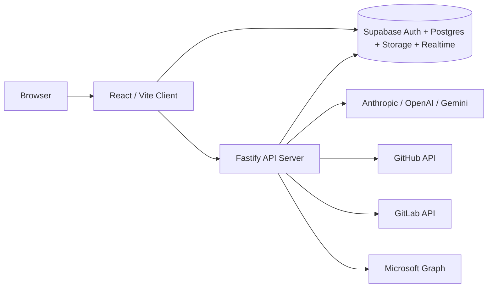

# Odyssey

> AI-assisted project operations for engineering teams, with project dashboards, task tracking, repo-aware analysis, reports, file previews, and multi-source activity in one workspace.

## Overview

Odyssey is a full-stack project management platform built around:

- project-level task and milestone tracking
- AI chat, AI insights, standups, task guidance, intelligent updates, and report generation
- GitHub and GitLab repository context
- Microsoft 365 document import
- Supabase-backed auth, data, storage, and realtime updates

The app is designed to work in two main modes:

1. local development on a single machine
2. shared internal hosting on a machine that users reach by IP address or hostname

For the code as it exists in this repository, the supported backend model is Supabase. A plain SQL database is not a drop-in replacement because the app depends on Supabase Auth, Storage, Realtime, RLS, and RPC behavior.

## Current State

Odyssey currently includes:

- persistent project dashboards with AI-generated summaries
- per-project tabs for overview, activity, tasks, metrics, reports, documents, integrations, and settings
- long-form project ID join codes that owners can regenerate or edit
- QR-based project invites with expiry and token redemption
- project privacy and join-request flows
- drag-reorderable project lists with shared ordering reflected in the dashboard
- always-available AI chat panel, including outside a specific project
- project inference in AI chat when the user references a project by name
- AI report generation with follow-up regeneration in a different format
- clickable repo names, file paths, and task references across AI-rendered markdown
- repo/file preview flows for GitHub and GitLab sources
- theme system with multiple built-in themes, including Odyssey Dark, USA, Digital Trident, NPS, Claude, GitHub Dark, Nord, and Dracula variants

## Tech Stack

| Layer | Technology |
| --- | --- |
| Frontend | React 19, TypeScript, Vite, Tailwind CSS 4 |
| Backend | Node.js, Fastify 5, TypeScript |
| Database | Supabase Postgres |
| Auth | Supabase Auth |
| Storage | Supabase Storage |
| Realtime | Supabase Realtime |
| AI providers | Anthropic, OpenAI, Google Gemini |
| Routing | React Router 7 |
| Markdown rendering | `react-markdown` + `remark-gfm` |
| Document/report tooling | `pdf-parse`, `mammoth`, `docx`, `jspdf`, `pptxgenjs` |

## Architecture



## Repository Layout

```text
Odyssey/
  client/                 React + Vite frontend
  server/                 Fastify backend
  supabase/               Base schema and incremental migrations
  setup.md                Detailed setup and deployment guide
```

High-value frontend areas:

- `client/src/pages/DashboardPage.tsx`
- `client/src/pages/ProjectDetailPage.tsx`
- `client/src/components/ProjectChat.tsx`
- `client/src/components/ReportsTab.tsx`
- `client/src/components/MarkdownWithFileLinks.tsx`
- `client/src/components/ProjectQRCode.tsx`
- `client/src/components/GoalEditModal.tsx`
- `client/src/lib/theme.tsx`

High-value backend areas:

- `server/src/index.ts`
- `server/src/routes/ai.ts`
- `server/src/routes/github.ts`
- `server/src/routes/gitlab.ts`
- `server/src/routes/microsoft.ts`
- `server/src/routes/uploads.ts`
- `server/src/routes/webhooks.ts`

## Feature Areas

### Projects And Dashboard

- multi-project dashboard with top-level health indicators
- hoverable dashboard stat cards with detail popovers
- project ordering by name, creation recency, or custom drag order
- shared project ordering reflected in both the projects page and dashboard
- project settings with editable project ID code, start date, description, privacy, and member controls

### Tasks And Execution Tracking

- task creation and editing with status, progress, category, line of effort, deadline, multi-assignee support, dependencies, comments, and AI guidance
- risk labels and project-level risk reporting
- task detail modal with markdown-rendered AI guidance and clickable repo/file/task references
- timeline, activity, and metrics views for project execution

### AI Features

- global AI chat panel
- project AI chat with repo, task, event, and document context
- AI-generated project insights
- intelligent update flow that proposes project/task changes
- 2-week standup generation and storage
- report generation to PDF, DOCX, or PPTX
- follow-up report edits through chat, including format changes after the first generation
- themed AI error popups that interpret common provider failures such as missing keys, billing/quota issues, or service unavailability

### Repo And File Awareness

- GitHub repo linking, browsing, commit ingestion, and file preview
- GitLab repo linking, browsing, commit ingestion, and file preview
- recursive file indexing for relative-path resolution
- clickable repo names and file references across AI output
- markdown-aware linking that can resolve:
  - full file paths
  - repo-qualified paths
  - suffix paths
  - bare filenames when they map cleanly

### Documents And Reports

- project document upload to Supabase Storage
- document text extraction for AI context
- Microsoft 365 document import flows
- saved reports per project
- goal reports, attachments, and comments

### Access And Collaboration

- project creation and ownership
- invite by project ID code
- QR-based invite generation and redemption
- private project join requests
- GitHub username-based member adds
- member role management

### Theming

Odyssey currently ships with these built-in themes:

- Odyssey Dark
- Odyssey Light
- One Dark Pro
- Dark Modern
- Light Modern
- Claude Dark
- Claude Light
- NPS Dark
- NPS Light
- USA
- Digital Trident
- GitHub Dark
- Nord
- Dracula

The theme system also drives AI markdown token styling, including distinct theme-aware colors for:

- clickable repos
- clickable files/programs
- clickable task references
- non-clickable formatted tokens

## AI Model Behavior

The UI exposes an AI model selector with:

- `Auto`
- Anthropic Claude models
- OpenAI models when configured
- Google Gemini models when configured

Provider availability depends on server-side keys. If a provider key is missing, that provider stays unavailable in the UI. If a request fails at runtime, the app now surfaces a themed error modal instead of a raw browser alert.

Main AI surfaces:

- dashboard AI summary
- project AI insights
- project AI chat
- task AI guidance
- intelligent update panel
- report generation chat

## Integrations

### Supabase

Supabase is the primary application backend and is required for full functionality.

Used for:

- auth
- relational data
- row-level security
- storage buckets
- realtime subscriptions
- RPCs for invite/join flows

### GitHub

GitHub integration supports:

- repository linking
- commit history ingestion
- file tree browsing
- file preview
- AI repo-aware context
- webhook ingestion for activity normalization

### GitLab

GitLab integration supports:

- repository linking
- commit history ingestion
- file tree browsing
- file preview
- AI repo-aware context

The preferred server env names are `GITLAB_TOKEN` and `GITLAB_HOST`.
For backward compatibility, the server still accepts the older `GITLAB_NPS_TOKEN` and `GITLAB_NPS_HOST` names.

### Microsoft 365

Microsoft integration supports:

- OneDrive document access
- OneNote content access
- Teams-related browsing paths where configured

This is backed by an Azure app registration and Microsoft Graph on the server.

## Environment Variables

### Client

Create `client/.env.local`:

```env
VITE_SUPABASE_URL=https://YOUR_PROJECT.supabase.co
VITE_SUPABASE_ANON_KEY=YOUR_SUPABASE_ANON_KEY
VITE_API_URL=
```

### Server

Create `server/.env`:

```env
NODE_ENV=development
HOST=0.0.0.0
PORT=3000

SUPABASE_URL=https://YOUR_PROJECT.supabase.co
SUPABASE_SERVICE_KEY=YOUR_SUPABASE_SERVICE_ROLE_KEY

CLIENT_URL=http://localhost:5173
CLIENT_DIST_PATH=

ANTHROPIC_API_KEY=
OPENAI_API_KEY=
GOOGLE_AI_API_KEY=

GITHUB_TOKEN=
GITHUB_WEBHOOK_SECRET=

GITLAB_TOKEN=
GITLAB_HOST=https://YOUR_HOST_URL

MICROSOFT_CLIENT_ID=
MICROSOFT_CLIENT_SECRET=
MICROSOFT_REDIRECT_URI=http://localhost:3000/api/microsoft/auth/callback
MICROSOFT_TOKEN_ENCRYPT_KEY=
```

Generate a Microsoft token encryption key:

```powershell
node -e "console.log(require('crypto').randomBytes(32).toString('hex'))"
```

## Running Locally

1. Clone the repository.
2. Install dependencies in the root, `client`, and `server`.
3. Create a Supabase project.
4. Apply `supabase/schema.sql`.
5. Apply all checked-in migrations in numeric order.
6. Create `client/.env.local`.
7. Create `server/.env`.
8. Add at least one AI provider key.
9. Start the API server.
10. Start the client.

Install dependencies:

```powershell
npm install
cd client
npm install
cd ..
cd server
npm install
cd ..
```

Start the server:

```powershell
cd server
npm run dev
```

Start the client:

```powershell
cd client
npm run dev
```

Default local URLs:

- frontend: `http://localhost:5173`
- API: `http://localhost:3000`

The Vite dev server proxies `/api` requests to `http://localhost:3000`.

## Internal Network Hosting

Odyssey supports shared internal hosting on a machine reachable by IP address or hostname.

Recommended production-style internal setup:

1. build the client
2. build the server
3. set `NODE_ENV=production`
4. set `HOST=0.0.0.0`
5. set `CLIENT_DIST_PATH=../client/dist`
6. run the built Fastify server

Build steps:

```powershell
cd client
npm run build
cd ..
cd server
npm run build
npm run start
```

Users then connect to:

- `http://YOUR_SERVER_IP:3000`

You can also front the server with a reverse proxy such as:

- Caddy
- Nginx
- IIS

## Database Notes

The repository contains:

- `supabase/schema.sql`
- `supabase/migration-*.sql`

Important checked-in migrations cover:

- policies and recursion fixes
- goal tracking improvements
- user connections
- project insights
- document storage
- standup reports
- saved reports
- task dependencies
- comments
- delete-project cascade handling
- invite codes and privacy
- QR invite tokens
- hardened project ID codes
- hardened project deletion via RPC
- notifications and shared chat foundations
- chat-thread membership recovery for project chats
- project-chat membership repair for users with existing project access

There are also goal report / goal attachment features in the UI that may require supplemental SQL depending on your target environment. See [`setup.md`](./setup.md) for the detailed operator guide and the manual SQL required for those pieces.

## Security Model

- Supabase RLS is enabled across core tables
- data access is scoped to project owners and members
- server-side keys stay on the backend only
- GitHub webhooks are signed
- Microsoft tokens are encrypted before storage
- AI provider keys are server-side only

## Project Status And Known Assumptions

This README reflects the repository in its current state, not an idealized deployment.

Important assumptions:

- Supabase is the intended backend
- AI features require at least one valid provider key
- repo-aware features require GitHub and/or GitLab server tokens
- Microsoft 365 features require Azure app registration
- full operator setup is documented in [`setup.md`](./setup.md)

## Setup Documentation

For the full deployment and environment manual, including:

- database bootstrap order
- Supabase auth configuration
- local development setup
- LAN/internal hosting setup
- supplemental SQL for report/attachment support
- troubleshooting and validation

read:

- [`setup.md`](./setup.md)

## Scripts

### Root

No main orchestration scripts are defined at the root. Install dependencies from the root and run the client/server separately.

### Client

```text
npm run dev
npm run build
npm run lint
npm run preview
```

### Server

```text
npm run dev
npm run build
npm run start
```

## Recommended Smoke Test

After setup, verify:

- you can sign in
- you can create a project
- you can create and edit tasks
- AI chat responds
- AI insights generate
- a repo can be linked and browsed
- file links in AI output are clickable
- a report can be generated
- a QR invite can be created
- a project can be joined by project ID code

## License / Ownership

No explicit open-source license is declared in this repository. If you intend to distribute or commercialize the code outside your organization, add a license file and any required contribution or deployment policy documentation.
