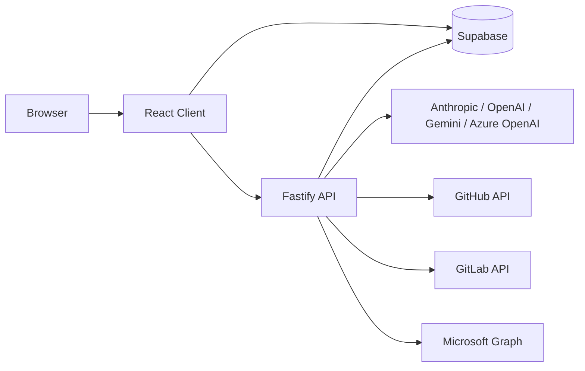

# Odyssey

> AI-assisted project operations for engineering teams, with tasks, timelines, chat, document context, repo activity, reporting, and cross-project coordination in one workspace.

## What Odyssey Is

Odyssey is a full-stack application, not just a React frontend. The repository includes:

- a Vite + React client in `client/`
- a Fastify API server in `server/`
- a Supabase schema and migration set in `supabase/`
- a self-hosted Supabase deployment in `deploy/supabase/`
- an Odyssey runtime container and VM helper scripts in `deploy/` and `scripts/vm/`

The current codebase expects Supabase features directly:

- Auth
- Postgres
- Storage
- Realtime
- RLS
- RPC-backed project and invite flows

A plain PostgreSQL database is not a drop-in replacement.

## What The Product Does

Core product areas in the current codebase:

- multi-project dashboard with AI summaries and project health
- detailed project pages with tabs for overview, timeline, tasks, activity, coordination, metrics, financials, reports, documents, integrations, and settings
- task tracking with dependencies, multi-assignee support, comments, AI guidance, time logging, categories, LOE, deadlines, and status/risk tracking
- global and project-scoped chat, including direct messages
- AI-generated project insights, standups, intelligent updates, and report generation
- GitHub and GitLab repository linking, commit activity, repo browsing, and file previews
- Microsoft 365 import flows for documents and notes
- invite-code, QR invite, private project, join-request, and shared access workflows
- theme support, including NPS-branded themes and several non-NPS themes

## Architecture



In development:

- the client usually runs on `http://localhost:5173`
- the API usually runs on `http://localhost:3000`
- Vite proxies `/api` and `/supabase` to the Fastify server

In production:

- the React app is built into static assets
- Fastify serves the built client and API from the same container
- Supabase runs as a separate compose stack

## How Hosting Works In This Repo

The checked-in production path is container-based and built around these pieces:

- [Dockerfile](/home/kyle/odyssey/Dockerfile)
  Builds the client, builds the server, then produces one runtime image that serves both.
- [deploy/docker-compose.odyssey.yml](/home/kyle/odyssey/deploy/docker-compose.odyssey.yml)
  Runs the Odyssey app container and wires it to Supabase.
- [deploy/supabase/docker-compose.yml](/home/kyle/odyssey/deploy/supabase/docker-compose.yml)
  Runs the self-hosted Supabase services.
- [scripts/vm/up.sh](/home/kyle/odyssey/scripts/vm/up.sh)
  Generates the derived Supabase env and brings the full stack up.
- [scripts/vm/down.sh](/home/kyle/odyssey/scripts/vm/down.sh)
  Stops the stack.
- [scripts/vm/generate-supabase-env.sh](/home/kyle/odyssey/scripts/vm/generate-supabase-env.sh)
  Syncs Odyssey app settings into the Supabase env, including auth redirect URLs.

The production container exposes port `3000`. Supabase services are exposed through the bundled gateway/proxy layer and are also routed back to the browser under `/supabase`.

## Repository Layout

```text
odyssey/
  client/                    React 19 + Vite frontend
  server/                    Fastify 5 API server
  supabase/                  Base schema and app migrations
  deploy/
    docker-compose.odyssey.yml
    odyssey.env.example
    supabase/                Self-hosted Supabase stack
  scripts/vm/                Bring-up, shutdown, schema, export/import helpers
  setup.md                   Longer setup and deployment guide
```

Important frontend entry points:

- [client/src/pages/DashboardPage.tsx](/home/kyle/odyssey/client/src/pages/DashboardPage.tsx)
- [client/src/pages/ProjectDetailPage.tsx](/home/kyle/odyssey/client/src/pages/ProjectDetailPage.tsx)
- [client/src/pages/ChatPage.tsx](/home/kyle/odyssey/client/src/pages/ChatPage.tsx)
- [client/src/pages/LoginPage.tsx](/home/kyle/odyssey/client/src/pages/LoginPage.tsx)
- [client/src/components/project-tabs/OverviewTab.tsx](/home/kyle/odyssey/client/src/components/project-tabs/OverviewTab.tsx)
- [client/src/components/project-tabs/ActivityTab.tsx](/home/kyle/odyssey/client/src/components/project-tabs/ActivityTab.tsx)
- [client/src/components/Timeline.tsx](/home/kyle/odyssey/client/src/components/Timeline.tsx)
- [client/src/components/CommitActivityCharts.tsx](/home/kyle/odyssey/client/src/components/CommitActivityCharts.tsx)

Important backend entry points:

- [server/src/index.ts](/home/kyle/odyssey/server/src/index.ts)
- [server/src/routes/ai.ts](/home/kyle/odyssey/server/src/routes/ai.ts)
- [server/src/routes/auth.ts](/home/kyle/odyssey/server/src/routes/auth.ts)
- [server/src/routes/github.ts](/home/kyle/odyssey/server/src/routes/github.ts)
- [server/src/routes/gitlab.ts](/home/kyle/odyssey/server/src/routes/gitlab.ts)
- [server/src/routes/microsoft.ts](/home/kyle/odyssey/server/src/routes/microsoft.ts)
- [server/src/routes/uploads.ts](/home/kyle/odyssey/server/src/routes/uploads.ts)
- [server/src/routes/coordination.ts](/home/kyle/odyssey/server/src/routes/coordination.ts)

Important database areas:

- [supabase/schema.sql](/home/kyle/odyssey/supabase/schema.sql)
- [supabase/](/home/kyle/odyssey/supabase)
- [deploy/supabase/README.md](/home/kyle/odyssey/deploy/supabase/README.md)
- [deploy/supabase/volumes/db/_supabase.sql](/home/kyle/odyssey/deploy/supabase/volumes/db/_supabase.sql)

## Tech Stack

| Layer | Technology |
| --- | --- |
| Frontend | React 19, TypeScript, Vite 8, Tailwind CSS 4 |
| Backend | Node.js, Fastify 5, TypeScript |
| Auth / DB / Storage / Realtime | Supabase |
| AI providers | Anthropic, OpenAI, Google Gemini, Azure OpenAI |
| Repo integrations | GitHub, GitLab |
| Microsoft integration | Microsoft Graph |
| Document tooling | `pdf-parse`, `mammoth`, `docx`, `jspdf`, `pptxgenjs`, `xlsx` |

## Deployment Modes

### 1. Local Development

Use this when you are building features or debugging.

Typical process:

- run Fastify from `server/`
- run Vite from `client/`
- point both at a Supabase project or local Supabase stack

Typical URLs:

- `http://localhost:5173` for the client
- `http://localhost:3000` for the API

### 2. Full Self-Hosted Stack

Use this when you want Odyssey and Supabase running together on one machine.

Typical process:

- create `deploy/odyssey.env`
- let the VM scripts generate `deploy/supabase/.env`
- run `bash scripts/vm/up.sh`

This is the most accurate way to run the repo as designed.

## Quick Start

### Local App Development Against Supabase

1. Install Node.js 22 or newer, npm, Docker, and Docker Compose.
2. Clone the repo.
3. Install dependencies in `client/` and `server/`.
4. Create a Supabase backend, either cloud-hosted or local/self-hosted.
5. Apply [supabase/schema.sql](/home/kyle/odyssey/supabase/schema.sql) and all migrations in [supabase/](/home/kyle/odyssey/supabase).
6. Create `client/.env.local`.
7. Create `server/.env`.
8. Start the server and client.

Client env:

```env
VITE_SUPABASE_URL=https://YOUR_PROJECT.supabase.co
VITE_SUPABASE_ANON_KEY=YOUR_SUPABASE_ANON_KEY
VITE_API_URL=http://127.0.0.1:3000
```

Server env:

```env
NODE_ENV=development
HOST=0.0.0.0
PORT=3000

SUPABASE_URL=https://YOUR_PROJECT.supabase.co
SUPABASE_SERVICE_KEY=YOUR_SUPABASE_SERVICE_ROLE_KEY

CLIENT_URL=http://localhost:5173
CLIENT_DIST_PATH=

ANTHROPIC_API_KEY=
OPENAI_API_KEY=
GOOGLE_AI_API_KEY=
AZURE_OPENAI_API_KEY=
AZURE_OPENAI_BASE_URL=
AZURE_OPENAI_MODEL=

GITHUB_TOKEN=
GITHUB_WEBHOOK_SECRET=

MICROSOFT_CLIENT_ID=
MICROSOFT_CLIENT_SECRET=
MICROSOFT_TENANT_URL=https://login.microsoftonline.com/common
MICROSOFT_REDIRECT_URI=http://localhost:3000/api/microsoft/auth/callback
MICROSOFT_TOKEN_ENCRYPT_KEY=

AI_KEY_SECRET=
```

Commands:

```bash
cd client && npm install
cd ../server && npm install
cd ../server && npm run dev
cd ../client && npm run dev
```

### Full Local Or VM Deployment With Bundled Supabase

1. Install Docker and Docker Compose.
2. Copy [deploy/odyssey.env.example](/home/kyle/odyssey/deploy/odyssey.env.example) to `deploy/odyssey.env`.
3. Update `CLIENT_URL` and any provider/integration settings.
4. Run the VM helper.

```bash
cp deploy/odyssey.env.example deploy/odyssey.env
bash scripts/vm/up.sh
```

The helper will:

- generate or update `deploy/supabase/.env`
- align Supabase auth redirect URLs with `CLIENT_URL`
- build the Odyssey runtime image
- start Supabase and Odyssey together

To stop the stack:

```bash
bash scripts/vm/down.sh
```

## Non-NPS Setup Notes

This repository can be used outside NPS. The NPS-specific branding and sample values are not hard requirements.

For a non-NPS deployment:

- set `CLIENT_URL` to your own hostname or local URL
- use `MICROSOFT_TENANT_URL=https://login.microsoftonline.com/common` unless you have a tenant-specific reason not to
- set `MICROSOFT_REDIRECT_URI` to your own Odyssey host, for example `https://your-domain.example/api/microsoft/auth/callback`
- supply your own GitHub, GitLab, Google, Microsoft, and AI credentials
- do not rely on any checked-in NPS hostnames or example tenant IDs

Important clarification:

- names like `GITLAB_NPS_HOST` in the example env are legacy/example naming, not a hard dependency on NPS
- the live GitLab integration is project-driven and stores the actual GitLab host and repo URL in integration config
- NPS themes are optional UI themes, not deployment requirements

If you are standing up a brand-new non-NPS install, start from [deploy/odyssey.env.example](/home/kyle/odyssey/deploy/odyssey.env.example), not from an environment file that already contains organization-specific values.

## Environment Variables

### App-Level Runtime

Main file for the containerized deployment:

- `deploy/odyssey.env`

Common keys:

- `CLIENT_URL`
- `ANTHROPIC_API_KEY`
- `OPENAI_API_KEY`
- `GOOGLE_AI_API_KEY`
- `AZURE_OPENAI_API_KEY`
- `AZURE_OPENAI_BASE_URL`
- `AZURE_OPENAI_MODEL`
- `GITHUB_TOKEN`
- `GITHUB_WEBHOOK_SECRET`
- `GITHUB_OAUTH_CLIENT_ID`
- `GITHUB_OAUTH_CLIENT_SECRET`
- `GOOGLE_OAUTH_CLIENT_ID`
- `GOOGLE_OAUTH_CLIENT_SECRET`
- `MICROSOFT_CLIENT_ID`
- `MICROSOFT_CLIENT_SECRET`
- `MICROSOFT_TENANT_URL`
- `MICROSOFT_REDIRECT_URI`
- `MICROSOFT_TOKEN_ENCRYPT_KEY`

### Derived Supabase Runtime

Generated file:

- `deploy/supabase/.env`

This file is partly managed by [scripts/vm/generate-supabase-env.sh](/home/kyle/odyssey/scripts/vm/generate-supabase-env.sh). It sets:

- Supabase public URL
- site URL
- redirect URLs
- provider enablement flags for Supabase Auth
- generated keys when missing

Do not treat this as a purely hand-maintained file if you are using the VM scripts.

## Auth And Identity

Odyssey currently supports:

- Supabase Auth
- username/password auth flows built on top of Supabase
- Google OAuth through Supabase Auth when configured
- Microsoft account linking and Microsoft Graph document access when configured

For production use, verify these are aligned:

- `CLIENT_URL`
- Supabase `SITE_URL`
- Supabase redirect URLs
- Microsoft redirect URI
- any OAuth provider callback URLs

The VM scripts handle much of this automatically when you use the bundled deployment path.

## Repo Integrations

### GitHub

Supports:

- repository linking
- commit activity
- file tree browsing
- file preview
- webhook-backed activity ingestion
- AI context from linked repos

### GitLab

Supports:

- repository linking by full repo URL
- per-project repo host tracking
- encrypted per-user project tokens
- commit activity
- file tree browsing
- file preview
- AI context from linked repos

The checked-in code no longer assumes a single global GitLab host.

## Microsoft 365 Integration

Supports:

- Microsoft sign-in/account linking
- OneDrive browsing and import
- OneNote content access
- Graph-backed document ingestion

For non-NPS users, the main requirement is your own Azure app registration. The code does not require an NPS tenant.

## Build And Run Commands

### Client

```bash
npm run dev
npm run build
npm run lint
npm run preview
```

### Server

```bash
npm run dev
npm run build
npm run start
```

### Full Stack

```bash
bash scripts/vm/up.sh
bash scripts/vm/down.sh
```

## Recommended Smoke Test

After setup, verify all of these before calling the environment healthy:

- sign in works
- project creation works
- task create/edit works
- the dashboard loads project data
- the project overview and timeline load
- AI chat works with at least one configured provider
- contributor and activity views load without auth errors
- GitHub or GitLab linking works
- repo commit activity appears when repos are linked
- Microsoft import works if Microsoft integration is enabled
- reports can be generated and saved
- invites and join flows work

## Where To Read Next

- [setup.md](/home/kyle/odyssey/setup.md) for the longer operator guide
- [deploy/VM_MIGRATION.md](/home/kyle/odyssey/deploy/VM_MIGRATION.md) for VM-oriented notes
- [deploy/supabase/README.md](/home/kyle/odyssey/deploy/supabase/README.md) for the bundled Supabase stack

## License

No explicit open-source license is declared in this repository. If you plan to distribute it outside your organization, add the appropriate license and policy files first.
