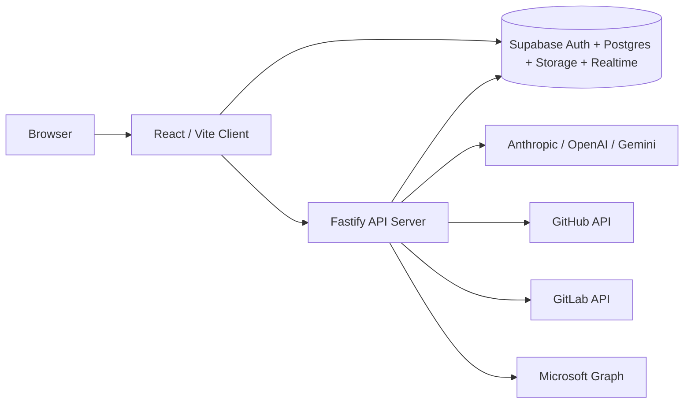

# Odyssey Setup Guide

This guide explains how to bring the Odyssey codebase fully online after cloning the repository.

It is written for the repository in its current state and is intended to help two kinds of users:

1. a developer running Odyssey locally on their own machine
2. an operator hosting Odyssey on a machine that other users reach by IP address or internal web address

Odyssey is not just a frontend app. A fully working deployment depends on:

- the React client
- the Fastify API server
- Supabase Postgres
- Supabase Auth
- Supabase Storage
- Supabase Realtime
- optional AI provider keys
- optional GitHub, GitLab, and Microsoft 365 integrations

## Table of Contents

- [1. Read This First](#1-read-this-first)
- [2. What You Are Setting Up](#2-what-you-are-setting-up)
- [3. Supported Deployment Modes](#3-supported-deployment-modes)
- [4. Prerequisites](#4-prerequisites)
- [5. Clone The Repository](#5-clone-the-repository)
- [6. Install Dependencies](#6-install-dependencies)
- [7. Create And Configure Supabase](#7-create-and-configure-supabase)
- [8. Apply The Database Schema And Migrations](#8-apply-the-database-schema-and-migrations)
- [9. Create Required Storage Buckets And Supplemental Tables](#9-create-required-storage-buckets-and-supplemental-tables)
- [10. Configure Supabase Auth URLs](#10-configure-supabase-auth-urls)
- [11. Create Environment Files](#11-create-environment-files)
- [12. Configure Optional Integrations](#12-configure-optional-integrations)
- [13. Run Odyssey Locally](#13-run-odyssey-locally)
- [14. Host Odyssey On A Shared Machine](#14-host-odyssey-on-a-shared-machine)
- [15. Validate The Deployment](#15-validate-the-deployment)
- [16. Troubleshooting](#16-troubleshooting)
- [17. Operator Checklists](#17-operator-checklists)
- [18. Final Notes](#18-final-notes)

## 1. Read This First

The most important setup fact is this:

Odyssey is currently built around Supabase, not around a generic SQL database abstraction.

That means a plain PostgreSQL or other SQL database is not enough by itself. The current codebase expects:

- Supabase Auth
- Supabase Storage
- Supabase Realtime
- row-level security behavior
- Supabase RPC usage in places like join and invite flows

If you want the code to work with minimal friction and full feature support, use one of these:

- Supabase Cloud
- self-hosted Supabase

If you decide to use some other SQL backend, you should assume extra engineering work will be required to replace or reimplement Supabase-specific behavior.

[Back to top](#table-of-contents)

## 2. What You Are Setting Up

At a high level, the running system looks like this:



Repository layout:

```text
Odyssey/
  client/                 React + Vite frontend
  server/                 Fastify backend
  supabase/
    schema.sql            base schema
    migration-*.sql       feature migrations
  setup.md                this guide
```

The client and server are separate processes in development. In a shared internal deployment, you will usually build the client and have Fastify serve the built frontend.

[Back to top](#table-of-contents)

## 3. Supported Deployment Modes

Odyssey supports two main usage patterns.

### Local Development

Best for:

- personal development
- debugging
- UI work
- feature testing

Typical URLs:

- frontend: `http://localhost:5173`
- API: `http://localhost:3000`

Typical process model:

- Vite dev server for the client
- Fastify dev server for the backend

### Shared Internal Hosting

Best for:

- a team accessing a shared machine
- a lab or office network deployment
- internal demos or internal operational use

Typical URL:

- `http://YOUR_SERVER_IP:3000`
- or `http://your-hostname:3000`

Typical process model:

- built React client
- built Fastify server
- optional reverse proxy in front

[Back to top](#table-of-contents)

## 4. Prerequisites

Install these before you begin:

- Git
- Node.js 20 or newer
- npm
- a Supabase account or self-hosted Supabase environment

Strongly recommended:

- VS Code
- Supabase CLI
- Postman or Insomnia
- a modern browser for testing

Optional accounts and credentials:

- Anthropic, OpenAI, and/or Google AI
- a GitHub token
- a GitLab token
- an Azure app registration for Microsoft 365 integration

Before you start, it is helpful to decide:

- whether this deployment is local-only or shared
- whether you want AI features enabled immediately
- whether you need GitHub and/or GitLab repo integration
- whether you need Microsoft 365 integration

[Back to top](#table-of-contents)

## 5. Clone The Repository

Clone the repository to the machine where Odyssey will run.

```powershell
git clone https://github.com/khicks1724/odyssey.git
cd odyssey
```

If this is a shared internal machine, place it in a stable location.

Examples:

```text
C:\Apps\Odyssey
```

```text
/opt/odyssey
```

[Back to top](#table-of-contents)

## 6. Install Dependencies

Odyssey uses separate package roots for the root, client, and server. Install dependencies in all relevant locations.

```powershell
npm install
cd client
npm install
cd ..
cd server
npm install
cd ..
```

Why this matters:

- the root contains shared package references used by the repo
- `client/` contains the frontend dependencies
- `server/` contains the backend dependencies

Do not assume a single `npm install` at the root is enough.

[Back to top](#table-of-contents)

## 7. Create And Configure Supabase

Create a fresh Supabase project for Odyssey.

You will need these values from the Supabase dashboard:

- project URL
- anon public key
- service role key

Where to find them:

- `Project Settings -> API`

Recommended approach:

- create one Supabase project for local/dev use
- create a separate Supabase project for any shared internal environment
- do not reuse an unrelated existing production database

Why separate environments help:

- less risk of accidental data loss during development
- cleaner auth configuration
- safer migration testing
- easier rollback and troubleshooting

[Back to top](#table-of-contents)

## 8. Apply The Database Schema And Migrations

This is the part that most directly determines whether Odyssey behaves correctly. If the database is only partially configured, the UI may load but important features will fail.

### Apply SQL In This Order

1. [`supabase/schema.sql`](./supabase/schema.sql)
2. every migration in `supabase/` in ascending numeric order

Because the repository does not currently include a checked-in Supabase project config for one-command migration bootstrapping, the safest method is:

1. open the Supabase SQL Editor
2. run `schema.sql`
3. run each migration file one at a time
4. verify each completes successfully
5. move to the next file

### Current Migration Order

Run these after `schema.sql`:

- `migration-002-policies.sql`
- `migration-003-fix-recursion.sql`
- `migration-004-features.sql`
- `migration-005-improvements.sql`
- `migration-006-goal-tracking.sql`
- `migration-007-user-connections.sql`
- `migration-008-project-insights.sql`
- `migration-009-loe-multiassignee.sql`
- `migration-010-document-storage.sql`
- `migration-011-file-upload-event-type.sql`
- `migration-012-source-check.sql`
- `migration-013-goals-updated-at.sql`
- `migration-014-standup-reports.sql`
- `migration-015-saved-reports.sql`
- `migration-016-goal-ai-guidance.sql`
- `migration-017-task-dependencies.sql`
- `migration-018-time-tracking.sql`
- `migration-019-goal-comments.sql`
- `migration-020-event-constraints.sql`
- `migration-021-delete-project-cascade.sql`
- `migration-022-invite-codes-privacy-join-requests.sql`
- `migration-023-qr-invite-tokens.sql`
- `migration-024-project-id-hardening.sql`
- `migration-025-delete-project-hardening.sql`
- `migration-026-notifications-and-chat.sql`
- `migration-027-remove-self-from-project.sql`
- `migration-028-chat-thread-membership-sync.sql`

### What These Migrations Cover

Collectively, the checked-in schema and migrations establish:

- core project and task data
- row-level security policies
- project insights
- saved reports
- standup reports
- task dependencies and comments
- invite code support
- privacy and join-request flows
- QR invite token support
- project document storage
- cascade-safe project deletion behavior
- notifications and shared chat foundations
- remove-from-project behavior that preserves shared projects for other users
- project-chat membership repair for users who should already see project chats

[Back to top](#table-of-contents)

## 9. Create Required Storage Buckets And Supplemental Tables

### Buckets Included By Checked-In Migrations

The checked-in migrations create the `project-documents` bucket through:

- [`supabase/migration-010-document-storage.sql`](./supabase/migration-010-document-storage.sql)

### Supplemental Goal Report And Attachment Setup

The current UI includes goal reports and attachments, but the repository-visible migrations do not fully define everything required for:

- `goal_reports`
- `goal_attachments`
- the `goal-attachments` storage bucket

If you want those features fully operational, run the SQL below after the standard migration sequence.

```sql
create table if not exists public.goal_reports (
  id          uuid primary key default gen_random_uuid(),
  goal_id     uuid not null references public.goals(id) on delete cascade,
  project_id  uuid not null references public.projects(id) on delete cascade,
  author_id   uuid references auth.users(id) on delete set null,
  content     text not null,
  status_at   text,
  progress_at integer,
  created_at  timestamptz not null default now()
);

alter table public.goal_reports enable row level security;

create policy "goal_reports_select" on public.goal_reports
for select using (
  exists (
    select 1
    from public.projects p
    where p.id = goal_reports.project_id
      and (
        p.owner_id = auth.uid()
        or exists (
          select 1 from public.project_members pm
          where pm.project_id = goal_reports.project_id
            and pm.user_id = auth.uid()
        )
      )
  )
);

create policy "goal_reports_insert" on public.goal_reports
for insert with check (
  exists (
    select 1
    from public.projects p
    where p.id = goal_reports.project_id
      and (
        p.owner_id = auth.uid()
        or exists (
          select 1 from public.project_members pm
          where pm.project_id = goal_reports.project_id
            and pm.user_id = auth.uid()
        )
      )
  )
);

create policy "goal_reports_delete" on public.goal_reports
for delete using (
  exists (
    select 1
    from public.projects p
    where p.id = goal_reports.project_id
      and (
        p.owner_id = auth.uid()
        or exists (
          select 1 from public.project_members pm
          where pm.project_id = goal_reports.project_id
            and pm.user_id = auth.uid()
        )
      )
  )
);

create index if not exists idx_goal_reports_goal_created
  on public.goal_reports(goal_id, created_at desc);

create table if not exists public.goal_attachments (
  id          uuid primary key default gen_random_uuid(),
  goal_id     uuid not null references public.goals(id) on delete cascade,
  project_id  uuid not null references public.projects(id) on delete cascade,
  author_id   uuid references auth.users(id) on delete set null,
  file_name   text not null,
  file_path   text not null,
  file_size   bigint,
  mime_type   text,
  created_at  timestamptz not null default now()
);

alter table public.goal_attachments enable row level security;

create policy "goal_attachments_select" on public.goal_attachments
for select using (
  exists (
    select 1
    from public.projects p
    where p.id = goal_attachments.project_id
      and (
        p.owner_id = auth.uid()
        or exists (
          select 1 from public.project_members pm
          where pm.project_id = goal_attachments.project_id
            and pm.user_id = auth.uid()
        )
      )
  )
);

create policy "goal_attachments_insert" on public.goal_attachments
for insert with check (
  exists (
    select 1
    from public.projects p
    where p.id = goal_attachments.project_id
      and (
        p.owner_id = auth.uid()
        or exists (
          select 1 from public.project_members pm
          where pm.project_id = goal_attachments.project_id
            and pm.user_id = auth.uid()
        )
      )
  )
);

create policy "goal_attachments_delete" on public.goal_attachments
for delete using (
  exists (
    select 1
    from public.projects p
    where p.id = goal_attachments.project_id
      and (
        p.owner_id = auth.uid()
        or exists (
          select 1 from public.project_members pm
          where pm.project_id = goal_attachments.project_id
            and pm.user_id = auth.uid()
        )
      )
  )
);
```

Then create the storage bucket and policies:

```sql
insert into storage.buckets (id, name, public)
values ('goal-attachments', 'goal-attachments', true)
on conflict (id) do nothing;

create policy "goal_attachments_storage_insert"
on storage.objects for insert to authenticated
with check (bucket_id = 'goal-attachments');

create policy "goal_attachments_storage_select"
on storage.objects for select to authenticated
using (bucket_id = 'goal-attachments');

create policy "goal_attachments_storage_delete"
on storage.objects for delete to authenticated
using (bucket_id = 'goal-attachments');
```

Why this section matters:

- without these objects, the UI may show report or attachment features that cannot persist data
- if you plan to use goal-level reporting, do not skip this step

[Back to top](#table-of-contents)

## 10. Configure Supabase Auth URLs

In Supabase, open:

- `Authentication -> URL Configuration`

Add URLs that match how users will actually access the application.

### For Local Development

- Site URL: `http://localhost:5173`
- Redirect URL: `http://localhost:5173`

### For Production-Style Shared Hosting

- Site URL: `http://YOUR_SERVER_IP:3000`
- Redirect URL: `http://YOUR_SERVER_IP:3000`

or use your hostname:

- Site URL: `http://your-hostname:3000`
- Redirect URL: `http://your-hostname:3000`

### For Temporary LAN Access Using Vite

If you temporarily expose the Vite dev server on the network:

- Site URL: `http://YOUR_SERVER_IP:5173`
- Redirect URL: `http://YOUR_SERVER_IP:5173`

If these values are wrong, sign-in and auth callback behavior will often fail even if the UI appears healthy.

[Back to top](#table-of-contents)

## 11. Create Environment Files

Odyssey uses separate environment files for the client and server.

### Client Environment

Create:

- `client/.env.local`

Recommended contents:

```env
VITE_SUPABASE_URL=https://YOUR_PROJECT.supabase.co
VITE_SUPABASE_ANON_KEY=YOUR_SUPABASE_ANON_KEY

# Optional absolute API base.
# Usually leave blank in local development because Vite proxies /api to localhost:3000.
VITE_API_URL=
```

What each variable does:

- `VITE_SUPABASE_URL`: tells the frontend which Supabase project to use
- `VITE_SUPABASE_ANON_KEY`: public client key used for frontend auth and data access
- `VITE_API_URL`: optional override for API calls when you do not want to rely on the dev proxy

### Server Environment

Create:

- `server/.env`

Recommended baseline:

```env
NODE_ENV=development
HOST=0.0.0.0
PORT=3000

SUPABASE_URL=https://YOUR_PROJECT.supabase.co
SUPABASE_SERVICE_KEY=YOUR_SUPABASE_SERVICE_ROLE_KEY

CLIENT_URL=http://localhost:5173

# AI providers
ANTHROPIC_API_KEY=
OPENAI_API_KEY=
GOOGLE_AI_API_KEY=

# GitHub
GITHUB_TOKEN=
GITHUB_WEBHOOK_SECRET=

# GitLab
GITLAB_NPS_TOKEN=
GITLAB_NPS_HOST=https://gitlab.nps.edu

# Microsoft 365
MICROSOFT_CLIENT_ID=
MICROSOFT_CLIENT_SECRET=
MICROSOFT_REDIRECT_URI=http://localhost:3000/api/microsoft/auth/callback
MICROSOFT_TOKEN_ENCRYPT_KEY=

# Production static hosting
CLIENT_DIST_PATH=
```

What the important server variables do:

- `NODE_ENV`: controls development vs production behavior
- `HOST`: network interface Fastify binds to
- `PORT`: API and production frontend port
- `SUPABASE_URL`: backend connection target for Supabase
- `SUPABASE_SERVICE_KEY`: privileged backend key, never expose this to the client
- `CLIENT_URL`: allowed frontend origin for backend CORS in development
- `CLIENT_DIST_PATH`: path to the built frontend when Fastify serves it in production mode

### Generate `MICROSOFT_TOKEN_ENCRYPT_KEY`

This must be a 64-character hex string.

PowerShell:

```powershell
[System.BitConverter]::ToString((1..32 | ForEach-Object { Get-Random -Max 256 })).Replace('-', '').ToLower()
```

Node:

```powershell
node -e "console.log(require('crypto').randomBytes(32).toString('hex'))"
```

[Back to top](#table-of-contents)

## 12. Configure Optional Integrations

You can get Odyssey working without every integration on day one. This section explains what each optional dependency unlocks.

### AI Providers

Odyssey supports:

- Anthropic
- OpenAI
- Google Gemini

Add at least one key to `server/.env` if you want AI features enabled.

Example:

```env
ANTHROPIC_API_KEY=your_key_here
```

AI-backed features include:

- AI chat
- AI insights
- intelligent updates
- task guidance
- standup generation
- report generation

### GitHub

Add to `server/.env`:

```env
GITHUB_TOKEN=ghp_or_github_app_token
GITHUB_WEBHOOK_SECRET=your_secret
```

This enables:

- GitHub repo linking
- repo tree browsing
- file preview
- commit ingestion
- AI repo-aware context
- webhook-backed activity ingestion

### GitLab

Add to `server/.env`:

```env
GITLAB_NPS_TOKEN=your_gitlab_token
GITLAB_NPS_HOST=https://gitlab.nps.edu
```

This enables:

- GitLab repo linking
- file tree browsing
- file preview
- commit ingestion
- AI repo-aware context

### Microsoft 365

Create an Azure app registration and set:

```env
MICROSOFT_CLIENT_ID=...
MICROSOFT_CLIENT_SECRET=...
MICROSOFT_REDIRECT_URI=http://localhost:3000/api/microsoft/auth/callback
MICROSOFT_TOKEN_ENCRYPT_KEY=64_CHAR_HEX
```

For a shared deployment, change the redirect URI to your machine IP or hostname.

This enables:

- OneDrive access
- OneNote import
- related Microsoft Graph-backed document flows

[Back to top](#table-of-contents)

## 13. Run Odyssey Locally

This is the recommended setup for a developer workstation.

### Step 1: Start The API Server

Open terminal one:

```powershell
cd server
npm run dev
```

Expected URL:

- `http://localhost:3000`

### Step 2: Start The Client

Open terminal two:

```powershell
cd client
npm run dev
```

Expected URL:

- `http://localhost:5173`

### Step 3: Understand The Dev Proxy

In development, Vite proxies `/api` requests to:

- `http://localhost:3000`

That means you usually do not need to set `VITE_API_URL` for local work.

### Step 4: First Sign-In And Smoke Check

After both processes are running:

1. open `http://localhost:5173`
2. create an account or sign in
3. create a project
4. open the project settings tab
5. create a task
6. open the task edit modal
7. generate AI insights or use AI chat
8. upload a project document
9. connect a GitHub or GitLab repo if configured
10. preview a file from a linked repo

If all of that works, your local stack is likely set up correctly.

[Back to top](#table-of-contents)

## 14. Host Odyssey On A Shared Machine

This section is for a machine other users connect to over the network.

### Option A: Temporary LAN Access Using Dev Servers

Use this only for internal testing or a short-lived demo.

#### Server

Set in `server/.env`:

```env
NODE_ENV=development
HOST=0.0.0.0
PORT=3000
CLIENT_URL=http://YOUR_SERVER_IP:5173
```

Run:

```powershell
cd server
npm run dev
```

#### Client

Run Vite on all interfaces:

```powershell
cd client
npm run dev -- --host 0.0.0.0
```

Users connect to:

- `http://YOUR_SERVER_IP:5173`

This is useful for:

- internal testing
- quick feedback sessions
- validating the app on another machine before a fuller deployment

### Option B: Production-Style Shared Internal Hosting

This is the recommended approach for a stable deployment.

#### Step 1: Build The Client

```powershell
cd client
npm run build
```

#### Step 2: Build The Server

```powershell
cd ..
cd server
npm run build
```

#### Step 3: Set Production Environment Values

Use values like:

```env
NODE_ENV=production
HOST=0.0.0.0
PORT=3000

SUPABASE_URL=https://YOUR_PROJECT.supabase.co
SUPABASE_SERVICE_KEY=YOUR_SERVICE_ROLE_KEY

CLIENT_URL=http://YOUR_SERVER_IP:3000
CLIENT_DIST_PATH=../client/dist
```

#### Step 4: Start The Built Server

```powershell
npm run start
```

Users connect to:

- `http://YOUR_SERVER_IP:3000`

or:

- `http://your-hostname:3000`

### Important Production Note

Set:

- `CLIENT_DIST_PATH=../client/dist`

The current server code does not automatically assume the `dist` directory. Without that variable, Fastify may point at the wrong frontend folder in production mode.

### Recommended Extras

For a cleaner internal deployment, consider placing a reverse proxy in front of Fastify:

- Caddy
- Nginx
- IIS

Benefits:

- one stable URL
- easier hostname mapping
- cleaner port handling
- optional TLS termination

[Back to top](#table-of-contents)

## 15. Validate The Deployment

After setup, test the application systematically.

### Core Product

- sign up
- sign in
- create a project
- edit project settings
- create and edit tasks
- delete a project

### Collaboration

- join by project ID code
- test private-project join requests
- test QR invite flow

### AI

- project AI chat works
- project AI insights generate
- task guidance generates
- standup generation works
- report generation works

### Repos

- connect a GitHub repo
- connect a GitLab repo
- browse repo trees
- preview files
- click repo/file links in AI output

### Documents And Reports

- upload a project document
- open a document link
- add a goal report
- add an attachment
- add a comment

[Back to top](#table-of-contents)

## 16. Troubleshooting

### The frontend loads, but auth or data do not work

Likely causes:

- missing `client/.env.local`
- wrong `VITE_SUPABASE_URL`
- wrong `VITE_SUPABASE_ANON_KEY`
- bad Supabase auth URL configuration

### The API starts, but many features still fail

Likely causes:

- missing `SUPABASE_SERVICE_KEY`
- wrong `SUPABASE_URL`
- missing migrations
- partially applied SQL

### Repo trees or file links do not work correctly

Likely causes:

- missing `GITHUB_TOKEN` or `GITLAB_NPS_TOKEN`
- token cannot access the repo
- repo path was linked incorrectly

### AI features fail

Likely causes:

- no provider key configured
- invalid provider key
- quota or billing exhaustion
- upstream provider outage

### Microsoft integration fails

Likely causes:

- redirect URI mismatch
- missing Azure client secret
- invalid `MICROSOFT_TOKEN_ENCRYPT_KEY`

### Production server starts, but the frontend does not render

Likely causes:

- client build was not created
- `CLIENT_DIST_PATH` is wrong
- `NODE_ENV` is not `production`

### Goal report or attachment features fail

Likely causes:

- missing `goal_reports`
- missing `goal_attachments`
- missing `goal-attachments` bucket
- missing bucket policies

[Back to top](#table-of-contents)

## 17. Operator Checklists

### Fastest Path To A Working Local Stack

- clone the repo
- install root, client, and server dependencies
- create a Supabase project
- run `schema.sql`
- run all migrations in order
- create `client/.env.local`
- create `server/.env`
- add at least one AI provider key
- run the server
- run the client
- sign in and test a project flow

### Shared Internal Machine Checklist

- create a dedicated Supabase project
- apply all SQL in order
- configure auth URLs for the shared machine URL
- create both env files
- configure required integration keys
- build the client
- build the server
- set `NODE_ENV=production`
- set `CLIENT_DIST_PATH=../client/dist`
- start Fastify
- test from a second machine on the network

[Back to top](#table-of-contents)

## 18. Final Notes

If you want the repository fully usable in its current form, these are the critical requirements:

- Supabase is configured correctly
- all schema and migration SQL is applied in order
- client and server env files are created correctly
- at least one AI provider key is added if AI is expected to work
- GitHub and GitLab tokens are configured if repo-aware functionality is expected
- Microsoft credentials are configured if Microsoft 365 features are needed
- supplemental report and attachment SQL is applied if those features will be used

If those pieces are in place, the current codebase supports:

- full local development on a personal machine
- shared internal hosting for users connecting by IP or hostname

[Back to top](#table-of-contents)
